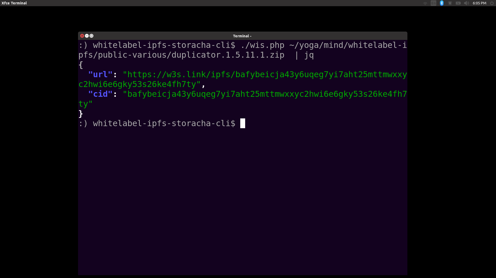

# wis.php (whitelabel-ipfs-storacha) 
The wis.php CLI can upload your ZIP files / plugins to IPFS using Storacha and simply retrieve the result as JSON { url, cid }.



### Prerequisites:
1. Register a free account at [Storacha](https://storacha.network/).
2. Ensure you have **Node.js** installed (requires version 18 or higher). Storacha currently mainly supports a NodeJS cli, which wis.php uses underneath. 
   - If not installed, download it from [nodejs.org](https://nodejs.org/en/download/) and follow the installation instructions or use [NVM](https://github.com/nvm-sh/nvm).

### Installation Steps:
**1. Install the CLI dependency**:
Open your terminal (or command prompt) and run the following command to install the `w3cli` globally:

```bash
npm install -g @web3-storage/w3cli
```

**2. Login + verify email**:
Log in using your email to authenticate with the service. Replace `alice@example.com` with your email:

```bash
w3 login alice@example.com
```
This will open a browser to complete authentication or provide further instructions via email.

**3. Create a Space**:
You need to create a space to register everything correctly:
```bash
w3 space create Documents
```

## Uploading a File (after setup complete)
To upload a file or directory and retrieve valid JSON, run:

```bash
./wis.php <path_to_your_file_or_directory>
```

Thank you! Made for the https://whitelabelpress.org project.
